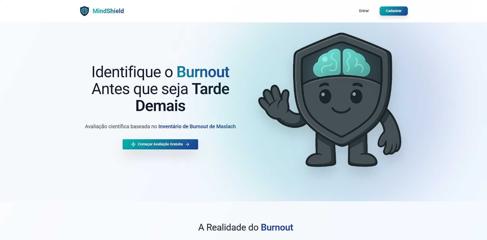
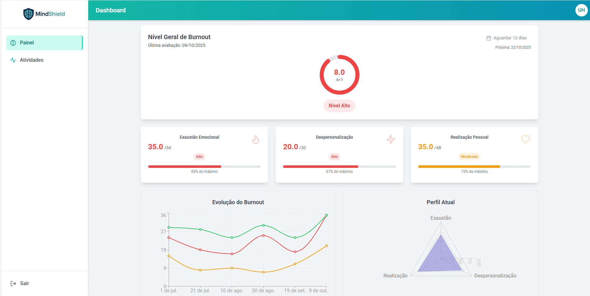
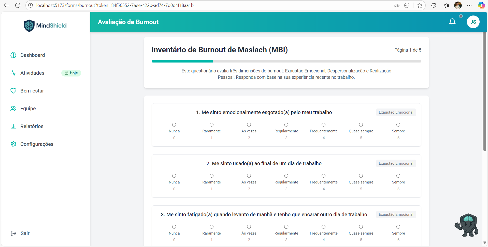

# Public Report: Full-Stack Platform Development and Infrastructure Modernization

## Project Team

- **Member:** Luiz Francisco Granville Gonçalves  
- **Advisor:** Raphael Garcia Moreira  
- **Institution:** Instituto de Tecnologia e Lideranças - Inteli
  
---

## Executive Summary

This report documents the comprehensive progress achieved during Module 3, spanning from August to October 2025, representing a critical phase in the MindShield project evolution. Building upon the solid MVP foundation established in Module 2, this module focused on strategic methodological refinement, complete platform integration, and infrastructure modernization. The most significant advancement was the strategic transition from the WHOQOL-BREF methodology to the scientifically validated **Maslach Burnout Inventory (MBI-22)**, a decision driven by implementation timelines and the need for more focused burnout assessment capabilities. This phase also marked the successful migration from Azure to **Amazon Web Services (AWS)** with full **Infrastructure as Code (IaC)** implementation using Terraform, alongside the development of a comprehensive user experience encompassing landing page, authentication systems, dashboard, and integrated reporting capabilities. The platform now stands as a production-ready solution, fully prepared for the market-focused initiatives planned for Module 4.

---

## Table of Contents

- [Public Report: Full-Stack Platform Development and Infrastructure Modernization](#public-report-full-stack-platform-development-and-infrastructure-modernization)
  - [Project Team](#project-team)
  - [Executive Summary](#executive-summary)
  - [Table of Contents](#table-of-contents)
  - [1. Introduction](#1-introduction)
  - [2. Strategic Methodological Evolution](#2-strategic-methodological-evolution)
    - [2.1 Transition to Maslach Burnout Inventory (MBI-22)](#21-transition-to-maslach-burnout-inventory-mbi-22)
    - [2.2 Methodological Integration and Analysis Framework](#22-methodological-integration-and-analysis-framework)
  - [3. Infrastructure Modernization and DevOps Excellence](#3-infrastructure-modernization-and-devops-excellence)
    - [3.1 Strategic Migration to Amazon Web Services (AWS)](#31-strategic-migration-to-amazon-web-services-aws)
    - [3.2 Infrastructure as Code (IaC) Implementation](#32-infrastructure-as-code-iac-implementation)
    - [3.3 DevOps Excellence and Operational Efficiency](#33-devops-excellence-and-operational-efficiency)
  - [4. Security Enhancements and Authentication Systems](#4-security-enhancements-and-authentication-systems)
    - [4.1 Robust Authentication Architecture](#41-robust-authentication-architecture)
    - [4.2 Data Protection and Privacy](#42-data-protection-and-privacy)
  - [5. Application Screenshots and User Interface](#5-application-screenshots-and-user-interface)
    - [5.1 Landing Page and Marketing Interface](#51-landing-page-and-marketing-interface)
    - [5.2 Authentication System](#52-authentication-system)
    - [5.3 Main Dashboard](#53-main-dashboard)
    - [5.4 MBI-22 Assessment Interface](#54-mbi-22-assessment-interface)
    - [5.5 Activity History and Management](#55-activity-history-and-management)
    - [5.6 Report Generation and Analysis](#56-report-generation-and-analysis)
  - [6. Technical Architecture and Implementation Details](#6-technical-architecture-and-implementation-details)
    - [6.1 Full-Stack Architecture Overview](#61-full-stack-architecture-overview)
    - [6.2 Database Architecture and Data Management](#62-database-architecture-and-data-management)
  - [7. Challenges Overcome and Strategic Decisions](#7-challenges-overcome-and-strategic-decisions)
    - [7.1 Methodological Transition Management](#71-methodological-transition-management)
    - [7.2 Infrastructure Migration Complexity](#72-infrastructure-migration-complexity)
    - [7.3 Integration and User Experience Challenges](#73-integration-and-user-experience-challenges)
  - [8. Future Roadmap and Market Preparation](#8-future-roadmap-and-market-preparation)
    - [8.1 Module 4 Strategic Focus: Marketing and Growth](#81-module-4-strategic-focus-marketing-and-growth)
  - [9. Conclusion](#9-conclusion)
  - [10. References](#10-references)

---

## 1. Introduction

Module 3 represents a pivotal transformation phase in the MindShield project, executed between August and October 2025. This period was characterized by strategic decision-making, technical excellence, and comprehensive platform maturation. The module's core objectives centered on evolving from a functional MVP to a market-ready, enterprise-grade solution capable of supporting real-world corporate wellness initiatives.

The strategic shift in methodology, infrastructure modernization, and complete user experience integration undertaken during this phase reflect a mature understanding of both the technical requirements and market demands for effective burnout prevention solutions. This report details these achievements while maintaining the established pattern of transparency regarding methodological approaches and technical implementations, while preserving the confidentiality of proprietary analytical processes.

---

## 2. Strategic Methodological Evolution

### 2.1 Transition to Maslach Burnout Inventory (MBI-22)

One of the most significant strategic decisions implemented during Module 3 was the methodological evolution from the WHOQOL-BREF approach to the internationally recognized **Maslach Burnout Inventory (MBI-22)**. This transition was driven by several critical factors:

- **Implementation Timeline Optimization:** The MBI-22's established validation and widespread acceptance in corporate environments eliminated the need for extensive data collection phases, allowing for more efficient implementation within the academic timeline constraints.

- **Scientific Validation and Reliability:** The Maslach Burnout Inventory represents the gold standard in burnout assessment, with over four decades of scientific validation across diverse professional contexts. The instrument's three-dimensional approach provides comprehensive evaluation across:
  - **Emotional Exhaustion:** 9 items measuring feelings of being emotionally overextended and depleted
  - **Depersonalization:** 5 items assessing detached and cynical attitudes toward work
  - **Personal Accomplishment:** 8 items evaluating feelings of competence and successful achievement

- **Corporate Relevance and Acceptance:** The MBI-22's established reputation in organizational psychology ensures higher acceptance rates among corporate stakeholders and facilitates integration into existing wellness programs.

### 2.2 Methodological Integration and Analysis Framework

The integration of the MBI-22 methodology within the MindShield platform encompasses several sophisticated analytical components:

- **Multi-dimensional Scoring System:** Implementation of the validated scoring algorithms that provide both dimension-specific insights and overall burnout risk assessment.

- **Interpretive Framework:** Development of contextual interpretation systems that translate raw scores into actionable insights while maintaining scientific rigor.

- **Longitudinal Analysis Capability:** Architecture designed to support trend analysis and progression monitoring over time, essential for early intervention strategies.

---

## 3. Infrastructure Modernization and DevOps Excellence

### 3.1 Strategic Migration to Amazon Web Services (AWS)

Module 3 marked a significant infrastructure evolution with the complete migration from Microsoft Azure to Amazon Web Services. This strategic decision was driven by several factors:

- **Cost Optimization:** AWS's pricing model and service offerings provided more favorable economics for the project's scale and requirements.

- **Service Ecosystem:** AWS's comprehensive service catalog offered better alignment with the project's long-term scalability and feature requirements.

- **Developer Experience:** Enhanced development workflows and more streamlined deployment processes.

### 3.2 Infrastructure as Code (IaC) Implementation

A cornerstone achievement of Module 3 was the implementation of comprehensive Infrastructure as Code using **Terraform**:

**Complete Resource Provisioning:**
- VPC configuration with public and private subnets across multiple availability zones
- ECS Fargate clusters for containerized application deployment
- RDS PostgreSQL instances with automated backup and monitoring
- Application Load Balancer (ALB) with SSL/TLS termination
- ECR repositories for container image management

**Automated Deployment Pipeline:**
- GitHub Actions integration for continuous integration and continuous deployment (CI/CD)
- Automated testing and security scanning
- Blue-green deployment strategies for zero-downtime updates
- Environment-specific configuration management

**Security and Compliance:**
- Implementation of AWS security best practices
- Automated SSL certificate management
- Network security groups and access control lists
- Encrypted data storage and transmission

### 3.3 DevOps Excellence and Operational Efficiency

**Containerization Strategy:**
- Docker optimization for both development and production environments
- Multi-stage build processes for minimized image sizes
- Health check implementation for automated container management

**Monitoring and Observability:**
- CloudWatch integration for comprehensive logging and monitoring
- Performance metrics tracking and alerting
- Cost monitoring and optimization alerts

---

## 4. Security Enhancements and Authentication Systems

### 4.1 Robust Authentication Architecture

Module 3 introduced significant enhancements to the platform's security infrastructure:

**Multi-layered Authentication:**
- JWT (JSON Web Token) implementation with HttpOnly and Secure cookies
- Session management with configurable expiration policies
- "Remember Me" functionality with extended session capabilities

**Password Security:**
- Bcrypt encryption for password storage
- Password complexity requirements and validation
- Secure password recovery mechanisms with time-limited tokens

### 4.2 Data Protection and Privacy

**Encryption and Data Security:**
- End-to-end encryption for data transmission
- At-rest encryption for database storage
- Secure API endpoint design with rate limiting
- GDPR and LGPD compliance considerations

**Access Control:**
- Role-based access control (RBAC) foundation
- API endpoint security with authentication middleware
- Secure session management and logout functionality

---

## 5. Application Screenshots and User Interface

The following section provides visual documentation of the MindShield platform's user interface and functionality, demonstrating the comprehensive integration achieved during Module 3:

### 5.1 Landing Page and Marketing Interface

The landing page showcases a professional and modern design that effectively communicates the MindShield value proposition. The interface features intuitive navigation, clear call-to-action elements, and responsive design optimized for both desktop and mobile devices.

### 5.2 Authentication System

The authentication system provides a secure and user-friendly login experience with modern design aesthetics. The interface includes options for traditional email/password authentication as well as Google OAuth integration, enhancing user convenience while maintaining security standards.

### 5.3 Main Dashboard

The main dashboard serves as the central hub for users, providing a comprehensive overview of their wellness status and platform activities. The interface displays key metrics, navigation options, and quick access to assessment tools in an intuitive and visually appealing layout.

### 5.4 MBI-22 Assessment Interface

The MBI-22 assessment interface demonstrates the platform's sophisticated questionnaire implementation. The forms feature progress tracking, clear question presentation, and user-friendly design that ensures a smooth assessment experience while maintaining scientific rigor.

### 5.5 Activity History and Management

The activity management screen provides users with comprehensive access to their assessment history and platform interactions. The interface displays assessment status, completion dates, and provides easy access to generated reports and analysis.

### 5.6 Report Generation and Analysis

The report generation feature showcases the platform's advanced analytics capabilities. Users can access detailed PDF reports containing comprehensive analysis, visualizations, and actionable recommendations based on their MBI-22 assessment results.

These screenshots demonstrate the platform's professional appearance, intuitive navigation, and comprehensive functionality that positions MindShield as an enterprise-ready solution for corporate wellness initiatives.

---

## 6. Technical Architecture and Implementation Details

### 6.1 Full-Stack Architecture Overview

The MindShield platform leverages a modern, microservices-inspired architecture designed for scalability, maintainability, and performance:

**Frontend Technology Stack:**
- **React 18** with **TypeScript** for type-safe, component-based user interfaces
- **Vite** for optimized development experience and production builds
- **Tailwind CSS** for utility-first styling and responsive design
- **Framer Motion** for smooth animations and micro-interactions
- **React Router** for client-side routing and navigation

**Backend Technology Stack:**
- **FastAPI** with **Python 3.11** for high-performance API development
- **SQLModel** for type-safe database operations and ORM functionality
- **PostgreSQL** for robust, scalable data persistence
- **Alembic** for database migration management
- **JWT** for secure authentication and session management

**Infrastructure and DevOps:**
- **Docker** containerization for consistent deployment environments
- **Terraform** for Infrastructure as Code (IaC) implementation
- **AWS ECS Fargate** for serverless container orchestration
- **AWS RDS** for managed database services
- **GitHub Actions** for automated CI/CD pipelines

### 6.2 Database Architecture and Data Management

**Schema Design:**
- Normalized database structure optimized for MBI-22 assessment data
- User management tables with comprehensive profile information
- Assessment response storage with temporal tracking capabilities
- Company and organizational relationship management

**Performance Optimization:**
- Database indexing strategies for optimal query performance
- Connection pooling for efficient resource utilization
- Caching implementation for frequently accessed data

---

## 7. Challenges Overcome and Strategic Decisions

### 7.1 Methodological Transition Management

The strategic shift from WHOQOL-BREF to MBI-22 presented several challenges that were successfully addressed:

**Technical Implementation Challenges:**
- Database schema redesign to accommodate the new assessment structure
- Frontend component refactoring for MBI-22 question formats
- Scoring algorithm implementation for the three-dimensional analysis framework

**Timeline Optimization:**
- Strategic decision to prioritize platform completeness over extended data collection phases
- Focus on proven methodological approaches to accelerate implementation
- Balancing scientific rigor with practical implementation constraints

### 7.2 Infrastructure Migration Complexity

The AWS migration required comprehensive planning and execution:

**Service Mapping and Migration:**
- Systematic evaluation of Azure services and AWS equivalents
- Data migration strategies ensuring zero data loss
- Environment configuration and secret management migration

**DevOps Pipeline Reconstruction:**
- Complete CI/CD pipeline redesign for AWS services
- Terraform script development and validation
- Testing and validation across multiple environments

### 7.3 Integration and User Experience Challenges

**Full-Stack Integration:**
- Seamless communication between frontend and backend components
- State management optimization for complex user workflows
- Performance optimization for smooth user experience

**Authentication System Implementation:**
- Secure session management across different user flows
- Google OAuth integration and configuration
- Remember Me functionality with security considerations

---

## 8. Future Roadmap and Market Preparation

### 8.1 Module 4 Strategic Focus: Marketing and Growth

With the technical foundation solidly established in Module 3, the project is positioned for its next critical phase focusing on market development and growth strategies:

**Market Validation and User Acquisition:**
- Target market analysis and customer persona refinement
- Marketing strategy development and implementation
- User feedback collection and platform optimization

**Business Development Initiatives:**
- Partnership development with corporate wellness providers
- Pricing strategy formulation and validation
- Sales process development and automation

**Platform Scaling Preparation:**
- Performance optimization for increased user loads
- Feature enhancement based on market feedback
- Integration capabilities with existing corporate systems

---

## 9. Conclusion

Module 3 represents a transformative phase in the MindShield project's evolution, successfully bridging the gap between a functional MVP and a market-ready, enterprise-grade solution. The strategic methodological transition to the Maslach Burnout Inventory, coupled with comprehensive platform integration and infrastructure modernization, has positioned the project for successful market entry and scaling.

The achievements documented in this report reflect a mature understanding of both technical excellence and business requirements. The decision to prioritize the proven MBI-22 methodology over extended data collection phases demonstrates strategic thinking aligned with academic timelines while maintaining scientific rigor. The complete AWS migration with Terraform implementation showcases infrastructure modernization capabilities essential for enterprise-grade solutions.

The comprehensive user experience integration, from landing page to detailed reporting capabilities, demonstrates the platform's readiness for real-world corporate wellness applications. The robust security implementations and authentication systems ensure that the platform meets enterprise security requirements while providing seamless user experiences.

As the project transitions into Module 4's market-focused initiatives, the technical foundation established during Module 3 provides a solid platform for growth, scaling, and market validation. The MindShield platform now stands as a comprehensive solution capable of addressing the critical corporate wellness challenges identified in the initial market research, with the technical sophistication and user experience quality necessary for competitive market success.

---

## 10. References

- **Scientific and Methodological Sources:**
  - Maslach, C., & Jackson, S. E. (1981). "The measurement of experienced burnout." Journal of Organizational Behavior, 2(2), 99-113.
  - Maslach, C., Jackson, S. E., & Leiter, M. P. (1996). "Maslach Burnout Inventory Manual (3rd ed.)." Consulting Psychologists Press.
  - World Health Organization. (2019). "Burn-out an occupational phenomenon: International Classification of Diseases." Available at: [WHO](https://www.who.int/news/item/28-05-2019-burn-out-an-occupational-phenomenon-international-classification-of-diseases)

- **Technical Documentation and Best Practices:**
  - AWS Well-Architected Framework. Available at: [AWS Architecture Center](https://aws.amazon.com/architecture/well-architected/)
  - Terraform Documentation. Available at: [Terraform](https://www.terraform.io/docs)
  - FastAPI Documentation. Available at: [FastAPI](https://fastapi.tiangolo.com/)
  - React Documentation. Available at: [React](https://react.dev/)

- **Industry and Market Research:**
  - Gallup, "State of the Global Workplace: 2025 Report"
  - Deloitte, "2025 Global Human Capital Trends"
  - McKinsey, "The Future of Work: Post-Pandemic Workplace Wellness"

- **Regulatory and Compliance Guidelines:**
  - GDPR – European Union: [GDPR](https://ec.europa.eu/info/law/law-topic/data-protection/data-protection-eu_en)
  - LGPD – Brazil: [LGPD](https://www.gov.br/mds/pt-br/acesso-a-informacao/governanca/integridade/campanhas/lgpd)
  - AWS Security Best Practices: [AWS Security](https://aws.amazon.com/security/security-resources/)

- **Previous Project Documentation:**
  - MindShield Public Report: Module 1 - Ideation Phase and Proof of Concept
  - MindShield Public Report: Module 2 - Minimum Viable Product Implementation
  - Internal project documentation and development logs (confidential)